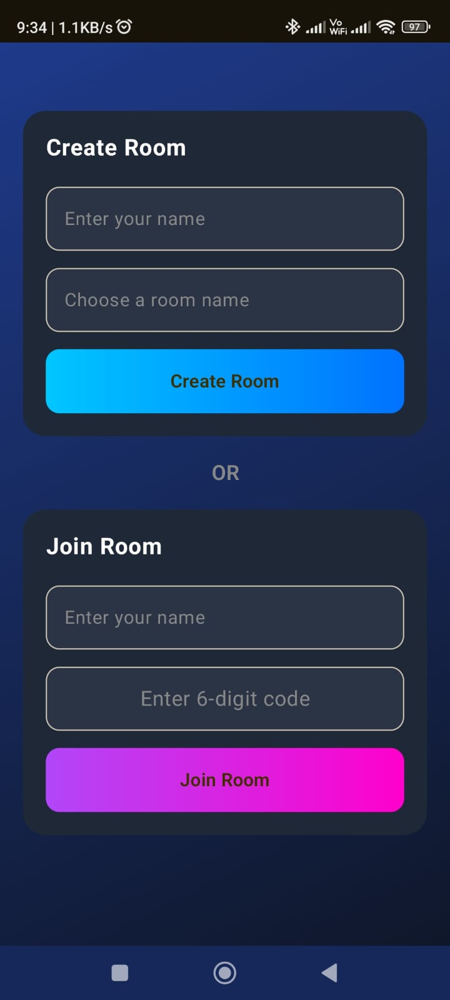
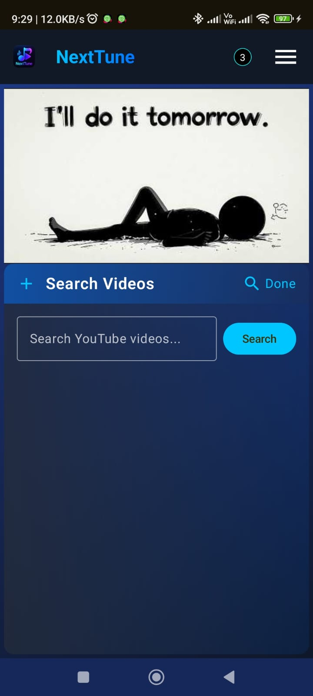
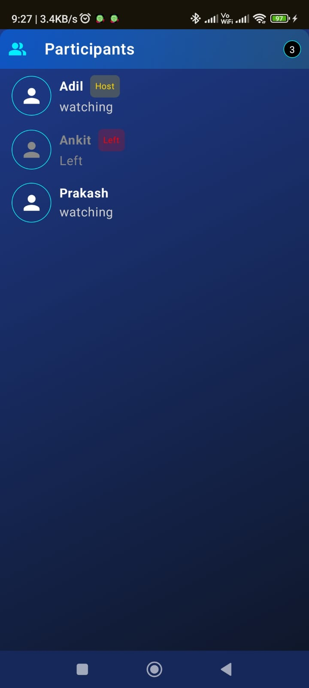
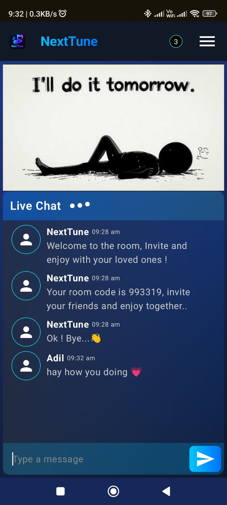
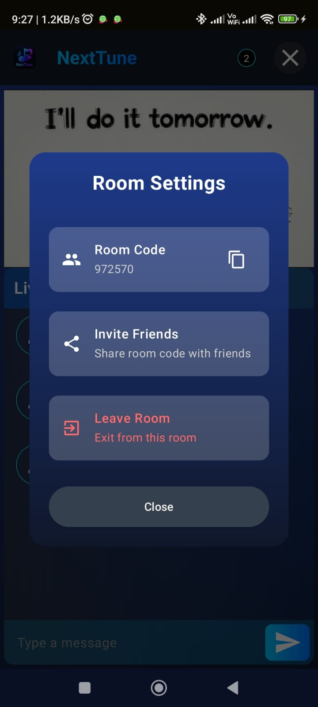
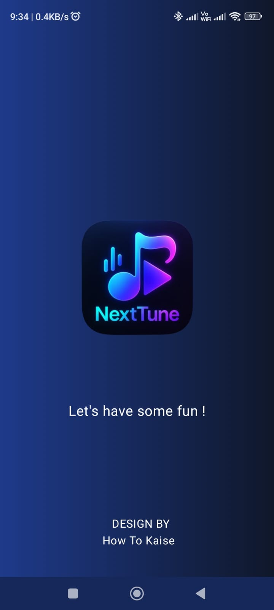

# 🚀 NextTune

**NextTune** is a collaborative YouTube streaming app where friends can create or join rooms to watch videos together and chat in real-time — just like being in the same room, even when miles apart.

---

## 🎬 Overview

NextTune synchronizes YouTube playback across multiple users while enabling real-time chatting and playlist control.  
Perfect for music sessions, watch parties, or collaborative playlists!

---

## ✨ Features

- 🎥 **Synchronized YouTube Playback** — Everyone watches the same moment, together.
- 💬 **Real-Time Chat** — Instant messaging within each room.
- 🧩 **Create or Join Rooms** — Host private or public watch sessions.
- 🎶 **Shared Queue** — Add, remove, or play songs collaboratively.
- 🔒 **Secure Room Handling** — Unique room IDs and admin control.
- 📱 **Clean, Modern UI** — Fully built with Jetpack Compose.

---

## 🛠️ Tech Stack

| Layer | Technology |
|-------|-------------|
| 🧩 UI | **Jetpack Compose (Material 3)** |
| 🎬 Video | **YouTube Player API** |
| 🔗 Networking | **Retrofit + YouTube Data API v3** |
| ⚡ Realtime | **Socket.IO (Node.js backend)** |
| 🧠 Architecture | **MVVM + Coroutines + Flow** |
| 💾 Local Storage | **Room Database** |

---

## 📸 Screenshots

| Home | Search | Participants |
|------|---------|--------------|
|  |  |  |

| Main | Settings | Splash |
|------|-----------|--------|
|  |  |  |

---

⭐ If you like this project, don’t forget to star the repo!

---